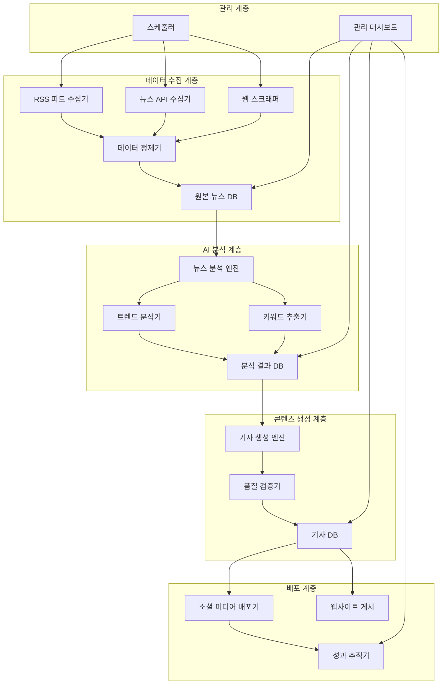

# AI 뉴스 시스템 설계 문서

## 개요

AI 기반 뉴스 수집, 분석, 생성 및 배포를 자동화하는 종합 시스템입니다. 실시간 뉴스 모니터링부터 소셜 미디어 배포까지 전 과정을 자동화하여 고품질의 분석 기사를 지속적으로 생산합니다.

## 아키텍처

### 시스템 아키텍처 다이어그램



### 기술 스택

- **백엔드**: Node.js, Express.js
- **데이터베이스**: MongoDB (문서 저장), Redis (캐싱)
- **AI/ML**: OpenAI GPT API, 자연어 처리 라이브러리
- **스케줄링**: node-cron
- **웹 스크래핑**: Puppeteer, Cheerio
- **소셜 미디어 API**: Twitter API, Facebook Graph API
- **프론트엔드**: Next.js, React
- **배포**: Docker, PM2

## 컴포넌트 및 인터페이스

### 1. 뉴스 수집 시스템 (News Collector)

#### 컴포넌트 구조
```javascript
class NewsCollector {
  constructor() {
    this.rssCollector = new RSSCollector();
    this.apiCollector = new APICollector();
    this.webScraper = new WebScraper();
    this.dataProcessor = new DataProcessor();
  }
  
  async collectNews() {
    // 다양한 소스에서 뉴스 수집
  }
  
  async processAndStore(rawNews) {
    // 데이터 정제 및 저장
  }
}
```

#### 주요 기능
- RSS 피드 파싱 및 수집
- 뉴스 API 연동 (NewsAPI, Guardian API 등)
- 웹 스크래핑을 통한 추가 데이터 수집
- 중복 제거 및 데이터 정제
- 품질 필터링

#### 데이터 모델
```javascript
const NewsSchema = {
  id: String,
  title: String,
  content: String,
  source: String,
  publishedAt: Date,
  url: String,
  category: String,
  keywords: [String],
  sentiment: Number,
  quality_score: Number,
  processed: Boolean,
  created_at: Date
}
```

### 2. AI 분석 엔진 (Analysis Engine)

#### 컴포넌트 구조
```javascript
class AnalysisEngine {
  constructor() {
    this.trendAnalyzer = new TrendAnalyzer();
    this.keywordExtractor = new KeywordExtractor();
    this.sentimentAnalyzer = new SentimentAnalyzer();
    this.predictionModel = new PredictionModel();
  }
  
  async analyzeNews(newsData) {
    // 뉴스 분석 및 인사이트 도출
  }
  
  async generateInsights(analysisResults) {
    // 트렌드 및 예측 생성
  }
}
```

#### 주요 기능
- 키워드 및 엔티티 추출
- 감정 분석 및 톤 분석
- 트렌드 패턴 인식
- 관련 뉴스 클러스터링
- 미래 동향 예측

#### 분석 결과 모델
```javascript
const AnalysisSchema = {
  news_id: String,
  keywords: [{ word: String, weight: Number }],
  entities: [{ name: String, type: String, confidence: Number }],
  sentiment: { score: Number, label: String },
  trends: [{ topic: String, strength: Number, direction: String }],
  predictions: [{ topic: String, probability: Number, timeframe: String }],
  related_news: [String],
  analysis_date: Date
}
```

### 3. 기사 생성 엔진 (Article Generator)

#### 컴포넌트 구조
```javascript
class ArticleGenerator {
  constructor() {
    this.gptClient = new OpenAIClient();
    this.templateEngine = new TemplateEngine();
    this.qualityChecker = new QualityChecker();
    this.seoOptimizer = new SEOOptimizer();
  }
  
  async generateArticle(analysisData) {
    // AI 기반 기사 생성
  }
  
  async optimizeForSEO(article) {
    // SEO 최적화
  }
}
```

#### 주요 기능
- GPT 기반 기사 자동 생성
- 다양한 기사 템플릿 지원
- SEO 최적화 (제목, 메타데이터, 키워드)
- 품질 점수 측정
- 편향성 검사

#### 기사 모델
```javascript
const ArticleSchema = {
  id: String,
  title: String,
  content: String,
  summary: String,
  category: String,
  tags: [String],
  seo: {
    title: String,
    description: String,
    keywords: [String]
  },
  quality_score: Number,
  bias_score: Number,
  readability_score: Number,
  source_analysis: [String],
  predictions: [String],
  status: String, // draft, review, approved, published
  created_at: Date,
  published_at: Date
}
```

### 4. 품질 관리 시스템 (Quality Management)

#### 컴포넌트 구조
```javascript
class QualityManager {
  constructor() {
    this.qualityChecker = new QualityChecker();
    this.biasDetector = new BiasDetector();
    this.factChecker = new FactChecker();
    this.readabilityAnalyzer = new ReadabilityAnalyzer();
  }
  
  async assessQuality(article) {
    // 종합 품질 평가
  }
  
  async flagForReview(article, issues) {
    // 검토 필요 기사 플래그
  }
}
```

#### 품질 기준
- **객관성**: 편향성 점수 < 0.3
- **가독성**: Flesch Reading Ease > 60
- **정확성**: 사실 확인 점수 > 0.8
- **완성도**: 구조적 완성도 > 0.9
- **SEO**: SEO 점수 > 0.7

### 5. 소셜 미디어 배포 시스템 (Social Media Distributor)

#### 컴포넌트 구조
```javascript
class SocialMediaDistributor {
  constructor() {
    this.twitterAPI = new TwitterAPI();
    this.linkedinAPI = new LinkedInAPI();
    this.facebookAPI = new FacebookAPI();
    this.contentOptimizer = new ContentOptimizer();
  }
  
  async distributeArticle(article) {
    // 다중 플랫폼 배포
  }
  
  async trackPerformance(postId, platform) {
    // 성과 추적
  }
}
```

#### 플랫폼별 최적화
- **Twitter**: 280자 요약 + 링크 + 해시태그
- **LinkedIn**: 전문적 톤 + 인사이트 강조
- **Facebook**: 시각적 요소 + 참여 유도

### 6. 관리 대시보드 (Admin Dashboard)

#### 주요 화면
1. **시스템 현황 대시보드**
   - 실시간 수집/생성/배포 현황
   - 시스템 상태 모니터링
   - 오류 및 알림 현황

2. **콘텐츠 관리**
   - 기사 목록 및 상태 관리
   - 품질 점수별 필터링
   - 수동 편집 및 승인 워크플로우

3. **성과 분석**
   - 기사별 조회수/공유수 통계
   - 소셜 미디어 성과 분석
   - 트렌드 예측 정확도 측정

4. **시스템 설정**
   - 뉴스 소스 관리
   - 스케줄 설정
   - AI 모델 파라미터 조정

## 데이터 모델

### 데이터베이스 설계

#### MongoDB 컬렉션 구조
```javascript
// 원본 뉴스 데이터
db.raw_news = {
  _id: ObjectId,
  title: String,
  content: String,
  source: String,
  url: String,
  published_at: Date,
  collected_at: Date,
  processed: Boolean
}

// 분석 결과
db.analysis_results = {
  _id: ObjectId,
  news_id: ObjectId,
  keywords: Array,
  trends: Array,
  predictions: Array,
  sentiment: Object,
  analyzed_at: Date
}

// 생성된 기사
db.articles = {
  _id: ObjectId,
  title: String,
  content: String,
  category: String,
  quality_metrics: Object,
  status: String,
  created_at: Date,
  published_at: Date
}

// 배포 기록
db.distribution_logs = {
  _id: ObjectId,
  article_id: ObjectId,
  platform: String,
  post_id: String,
  performance_metrics: Object,
  distributed_at: Date
}
```

## 오류 처리

### 오류 처리 전략
1. **수집 오류**: 재시도 로직 + 대체 소스 활용
2. **분석 오류**: 부분 분석 결과 저장 + 수동 검토 플래그
3. **생성 오류**: 템플릿 기반 대체 생성 + 품질 점수 하향 조정
4. **배포 오류**: 재시도 큐 + 관리자 알림

### 로깅 및 모니터링
```javascript
const ErrorHandler = {
  logError: (error, context) => {
    // 구조화된 오류 로깅
  },
  
  sendAlert: (severity, message) => {
    // 심각도별 알림 발송
  },
  
  trackMetrics: (operation, duration, success) => {
    // 성능 메트릭 추적
  }
}
```

## 테스트 전략

### 테스트 계층
1. **단위 테스트**: 각 컴포넌트별 기능 테스트
2. **통합 테스트**: API 연동 및 데이터 플로우 테스트
3. **E2E 테스트**: 전체 워크플로우 테스트
4. **성능 테스트**: 대용량 데이터 처리 테스트
5. **AI 품질 테스트**: 생성된 콘텐츠 품질 평가

### 테스트 자동화
```javascript
// 예시: 기사 생성 품질 테스트
describe('Article Generation Quality', () => {
  test('should generate unbiased content', async () => {
    const article = await articleGenerator.generate(testData);
    expect(article.bias_score).toBeLessThan(0.3);
  });
  
  test('should include future predictions', async () => {
    const article = await articleGenerator.generate(testData);
    expect(article.predictions).toHaveLength.greaterThan(0);
  });
});
```

## 보안 고려사항

### 데이터 보안
- API 키 암호화 저장
- 사용자 인증 및 권한 관리
- 데이터 전송 시 HTTPS 사용
- 민감 정보 마스킹

### AI 보안
- 프롬프트 인젝션 방지
- 생성 콘텐츠 필터링
- 편향성 모니터링
- 사실 확인 메커니즘

## 성능 최적화

### 확장성 고려사항
- 마이크로서비스 아키텍처 적용 가능
- 수평적 확장을 위한 로드 밸런싱
- 캐싱 전략 (Redis 활용)
- 데이터베이스 샤딩 고려

### 리소스 최적화
- 배치 처리를 통한 효율성 향상
- 우선순위 기반 작업 큐
- 메모리 사용량 모니터링
- API 호출 최적화